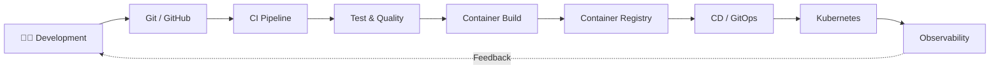

<div align="center">

# 👋 Hi, I'm Dapravith Rotha

### Full-Stack Engineer · DevOps Engineer

Building reliable applications, backend services, delivery pipelines, and cloud-native infrastructure.

📍 Phnom Penh, Cambodia

[](https://github.com/Dapravith)
[](https://dapravith.vercel.app/)
[](https://x.com/Rdapravith)

</div>

---

## `dapravith@github:~$ whoami`

```text
NAME        = Rotha Dapravith
ROLE        = Full-Stack Engineer / DevOps Engineer
LOCATION    = Phnom Penh, Cambodia

FOCUS       = Backend Engineering
              Full-Stack Development
              DevOps & Platform Engineering
              Cloud-Native Systems
              CI/CD & Observability

BUILDING    = Production-ready systems
              Automated delivery pipelines
              Microservices
              Developer platforms
```

I work across the application and infrastructure layers.

My main interests are designing maintainable backend systems, building modern web applications, automating software delivery, and operating applications reliably in production.

---

# ⚡ Engineering Focus

<table>
<tr>
<td width="50%" valign="top">

### 💻 Full-Stack Engineering

* TypeScript
* JavaScript
* Vue.js / Nuxt
* React / Next.js
* Node.js
* Express.js
* REST APIs
* Authentication & Authorization
* PostgreSQL
* MongoDB
* Redis

</td>
<td width="50%" valign="top">

### ⚙️ Backend Engineering

* Java
* Spring Boot
* Spring Security
* Spring Cloud
* Microservices
* Event-driven architecture
* Kafka
* REST APIs
* OAuth2 / OIDC
* Keycloak
* Database design
* API Gateway

</td>
</tr>

<tr>
<td width="50%" valign="top">

### 🚀 DevOps & Platform

* Docker
* Docker Compose
* Kubernetes
* Helm
* Jenkins
* GitHub Actions
* Argo CD
* GitOps
* Linux
* Nginx
* CI/CD

</td>

<td width="50%" valign="top">

### 📊 Observability & Infrastructure

* Prometheus
* Grafana
* Loki
* Grafana Alloy
* Terraform
* Cloudflare
* MinIO
* Kafka
* PostgreSQL
* Redis
* Monitoring
* Logging

</td>
</tr>
</table>

---

# 🛠 Technology Stack

### Languages

<p>

</p>

### Frontend

<p>

</p>

### Backend

<p>

</p>

### Data & Messaging

<p>

</p>

### DevOps & Cloud

<p>

</p>

### Engineering Tools

<p>

</p>

---

# 🚀 Delivery Pipeline



```text
Code
  │
  ▼
GitHub
  │
  ▼
CI
  ├── Build
  ├── Unit Test
  ├── Integration Test
  ├── Security / Quality Checks
  └── Container Build
          │
          ▼
    Container Registry
          │
          ▼
       CD / GitOps
          │
          ▼
       Kubernetes
          │
          ├── Application
          ├── Configuration
          ├── Secrets
          ├── Networking
          └── Scaling
                │
                ▼
        Prometheus · Loki
                │
                ▼
             Grafana
```

My goal is not simply to deploy applications.

I focus on creating a delivery process that is:

`Repeatable` · `Observable` · `Secure` · `Recoverable` · `Scalable`

---

# 🏗 Featured Engineering Projects

### ☕ Microservices & Java

**[Microservices-kakfa-springboot](https://github.com/Dapravith/Microservices-kakfa-springboot)**

Spring Boot microservices architecture with Kafka-based communication.

`Java` `Spring Boot` `Kafka` `Microservices`

---

**[spring-boot-3-microservices-course](https://github.com/Dapravith/spring-boot-3-microservices-course)**

Hands-on implementation of modern Spring Boot 3 microservice patterns.

`Java` `Spring Boot 3` `Microservices`

---

**[spring-boot-debezium-master-slave](https://github.com/Dapravith/spring-boot-debezium-master-slave)**

Exploring database replication and change data capture patterns.

`Spring Boot` `Debezium` `Database` `CDC`

---

### 🏦 Distributed Systems

**[Spring-Boot-Microservices-Banking-Application](https://github.com/Dapravith/Spring-Boot-Microservices-Banking-Application)**

Microservices-based banking application covering registration, accounts, transfers, transactions, service discovery, and API gateway patterns.

`Spring Boot` `Microservices` `API Gateway` `Service Discovery`

---

### 🔐 Identity & Security

**[springboot-sso-keycloak](https://github.com/Dapravith/springboot-sso-keycloak)**

Single Sign-On integration using Spring Boot and Keycloak.

`Spring Security` `Keycloak` `SSO` `OIDC`

---

**[spring-security-oauth](https://github.com/Dapravith/spring-security-oauth)**

Authentication and authorization experiments using Spring Security OAuth.

`Spring Security` `OAuth2` `Authentication`

---

# 🔧 Platform Engineering Mindset

```yaml
engineering:
  application:
    frontend:
      - Vue / Nuxt
      - React / Next.js
      - TypeScript

    backend:
      - Java / Spring Boot
      - Node.js / Express
      - Python / FastAPI

  architecture:
    - Modular Monolith
    - Microservices
    - Event-Driven Systems
    - REST APIs

  platform:
    containers:
      - Docker
      - Kubernetes
      - Helm

    delivery:
      - GitHub Actions
      - Jenkins
      - Argo CD
      - GitOps

    observability:
      - Prometheus
      - Grafana
      - Loki
      - Grafana Alloy

    infrastructure:
      - Linux
      - Nginx
      - Terraform
      - Cloudflare
```

---

# 🧠 What I'm Working Toward

My current engineering direction is deeper production experience across:

* Distributed backend systems
* Java concurrency and JVM performance
* High-throughput Spring Boot services
* Event-driven architecture with Kafka
* Kubernetes operations
* GitOps delivery with Argo CD
* Infrastructure as Code
* Production observability
* Reliability engineering
* Security-focused delivery pipelines
* Cloud-native architecture
* Platform engineering

---

# 🧩 Systems I Like Building

```text
┌─────────────────────────────────────────────────────────┐
│                      CLIENT LAYER                       │
│           Nuxt · Next.js · Vue · React                 │
└──────────────────────────┬──────────────────────────────┘
                           │
                           ▼
┌─────────────────────────────────────────────────────────┐
│                       API LAYER                         │
│       Spring Boot · Node.js · FastAPI · REST           │
└──────────────────────────┬──────────────────────────────┘
                           │
              ┌────────────┴────────────┐
              ▼                         ▼
┌───────────────────────┐    ┌───────────────────────────┐
│      DATA LAYER       │    │     EVENT / CACHE LAYER   │
│ PostgreSQL · MongoDB  │    │      Kafka · Redis        │
└───────────────────────┘    └───────────────────────────┘

                           │
                           ▼
┌─────────────────────────────────────────────────────────┐
│                    PLATFORM LAYER                       │
│ Docker · Kubernetes · Helm · Argo CD · GitHub Actions │
└──────────────────────────┬──────────────────────────────┘
                           │
                           ▼
┌─────────────────────────────────────────────────────────┐
│                  OBSERVABILITY LAYER                    │
│        Prometheus · Grafana · Loki · Alloy             │
└─────────────────────────────────────────────────────────┘
```

---

# 📈 GitHub Activity

<div align="center">


<br/>


</div>

---

# 🌐 Contribution Activity

<div align="center">


</div>

---

<details>
<summary><b>🔎 More about how I engineer systems</b></summary>

<br>

I prefer systems where the path from source code to production is explicit and automated.

```text
Requirement
    ↓
Architecture
    ↓
Implementation
    ↓
Code Review
    ↓
Automated Testing
    ↓
Continuous Integration
    ↓
Containerization
    ↓
Security / Quality Gates
    ↓
Continuous Delivery
    ↓
Infrastructure
    ↓
Observability
    ↓
Incident Feedback
    ↓
Engineering Improvement
```

A production system is more than application code.

It also needs deployment automation, infrastructure, security, monitoring, logging, recovery strategies, documentation, and operational ownership.

</details>

<details>
<summary><b>🎯 Current learning priorities</b></summary>

<br>

```text
01. Advanced Java & Spring Boot
02. JVM, concurrency and performance
03. Distributed systems
04. Kafka & event-driven architecture
05. PostgreSQL & Redis
06. Docker & Kubernetes
07. Helm & Argo CD
08. CI/CD architecture
09. Terraform & infrastructure automation
10. Prometheus, Grafana & Loki
11. Reliability engineering
12. System design
```

</details>

---

# 🤝 Connect

<div align="center">

Interested in **Full-Stack Engineering, Backend Systems, DevOps, Cloud Native, Kubernetes, CI/CD, or Platform Engineering?**

<br>

[](https://github.com/Dapravith)
[](https://dapravith.vercel.app/)
[](https://x.com/Rdapravith)

<br>

```text
dapravith@github:~$ build --ship --observe --improve
✓ Build reliable software
✓ Automate delivery
✓ Observe production
✓ Improve continuously
```

<sub>Rotha Dapravith · Full-Stack & DevOps Engineer</sub>

</div>
